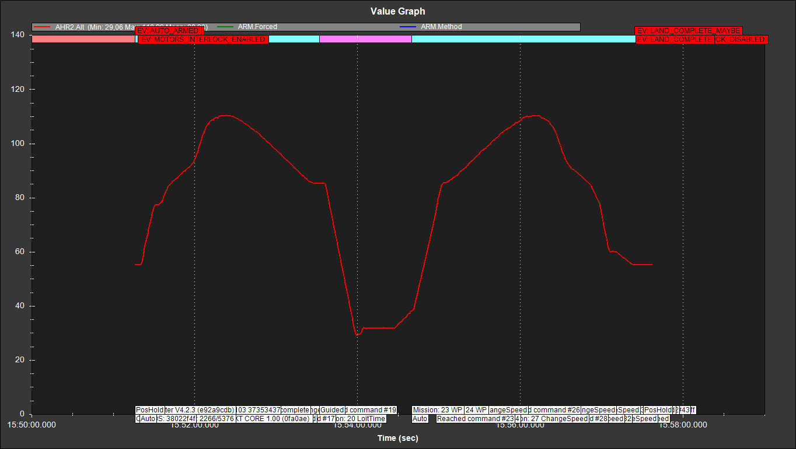
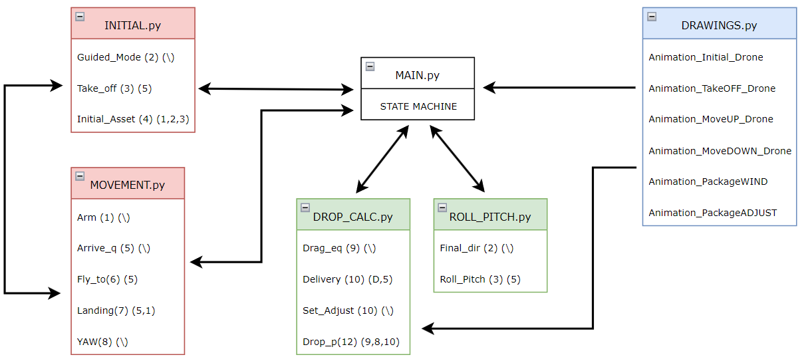
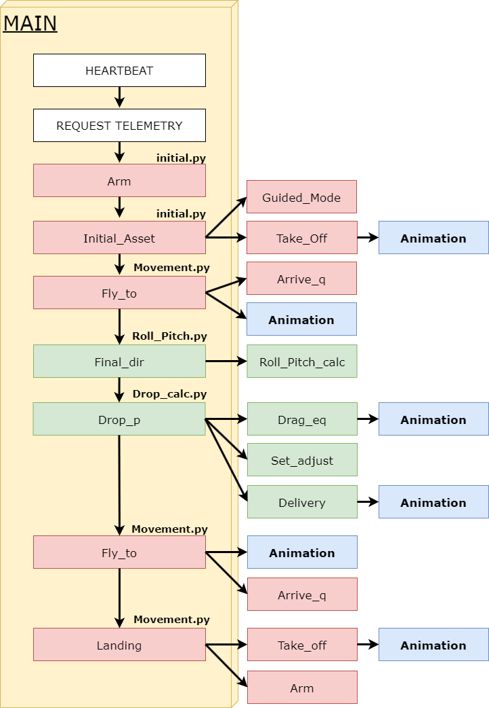

# Autonomous octocopter attitude system

This repository provides the project done during the curricular internship at Manna Drone Delivery ['https://www.manna.aero/'].

## 1] Pymavlink 
Testing of all instructions executed via the pymavlink protocol [https://mavlink.io/en/] and subsequently used in the final State Machine.

## 2] InitialStateMachine

Initial state machine created to execute a typical delivery profile, from takeoff to delivery following safety procedures, to return of the aircraft to the launch site.

Delivery profile (altitude vs. time)

## 3] Final_integration

