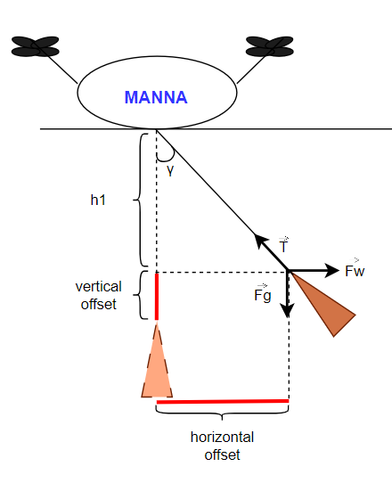

# Autonomous octocopter attitude system

This repository provides the project done during the curricular internship at Manna Drone Delivery ['https://www.manna.aero/'].

## 1] Pymavlink 
Testing of all instructions executed via the pymavlink protocol [https://mavlink.io/en/] and subsequently used in the final State Machine.

## 2] InitialStateMachine

Initial state machine created to execute a typical delivery profile, from takeoff to delivery following safety procedures, to return of the aircraft to the launch site.

Delivery profile (altitude vs. time)

## 3] Final_integration

The problem that this study addresses is the need to perform precisely calibrated deliveries in
specific areas, preventing collisions with urban obstacles and damage to the vehicle or payload.
This process is to be analysed, tested and then autonomous to be integrated into the state machine
currently used by the Manna Drone Delivery company for deliveries.
This delivery system is based on releasing a bag containing the payload through a long wire that
is cut when the package reaches the ground, without landing the drone. Unfortunately, this process will be disturbed by atmospheric conditions that will change the asset of the package containing the delivery, inevitably generating an incorrect delivery position now no longer perpendicular
to the position of the drone in flight.
This asset will have to be corrected by generating a new drone offset and also changing the value
of the absolute position of the parcel. Considering a regular route for the houses in Balbriggan
(site where Manna is currently operating), it will be possible to estimate the new maximum offset
value to meet the safety terms for the other surrounding buildings.
The latest Drone model used by Manna is equipped with an automatic control system capable of
balancing the aircraft in flight when exposed to external forces due to weather conditions. This
system is fundamental, and also capable of maintaining a specific offset during the delivery phase.
Through this system, the aircraft will be able to generate the correct thrust in the correct direction to cancel out the opposite thrust, and through these parameters it is possible to estimate the
resulting wind force on the drone and therefore on the package, without using other sensors or
collecting local weather data.

  

  
   

